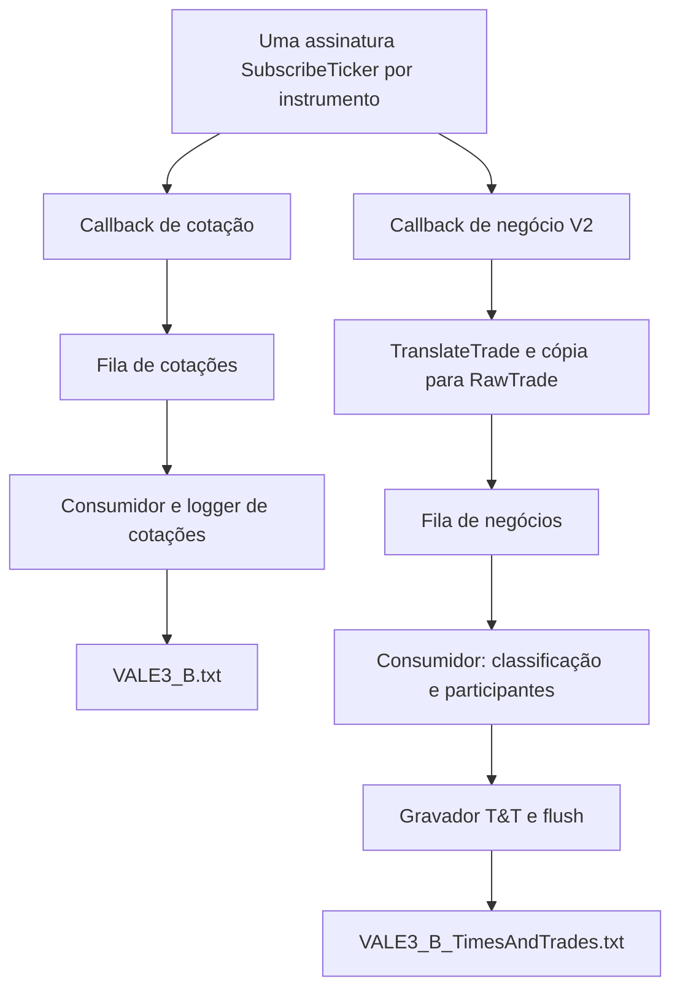

# DLLNelogica — Projeto Educacional

> Série **Programando o seu robô de trading com a DLL da Nelogica** — **Aula 03 concluída,
> com os marcos posteriores de observabilidade e Times and Trades: cotações e negócios
> em arquivos separados por instrumento.**

Exemplo didático em C# que demonstra, do zero, como estabelecer uma conexão com a
**ProfitDLL da Nelogica**: autenticar, confirmar que todos os serviços subiram, assinar
instrumentos, receber cotações e negócios realizados e finalizar a sessão de forma limpa.

Este material foi escrito para ensino. O objetivo é que você entenda **cada decisão** —
por que um callback não pode bloquear, por que um retorno `NL_OK` não significa "conectado",
por que um estado precisa ser travado e não reavaliado.

---

## Evolução da série

| Marco | Data | Resultado principal |
|-------|------|---------------------|
| Aula 01 | 2026-08-24 | Conexão, quatro estados obrigatórios e ciclo de vida da ProfitDLL |
| Aula 02 | 2026-08-26 | Relatório diário e observabilidade antes do Market Data |
| Retrofit pós-Aula 02 | 2026-08-28 | Arquitetura, DI manual, resiliência de callbacks e logging assíncrono |
| Aula 03 | 2026-09-06 | Consumo de Market Data: assinatura de instrumentos e cotações |
| Retrofit pós-Aula 03 | 2026-09-10 | Relatórios por instrumento e visão contínua do mercado |
| T&T — Sprint 1 | 2026-09-11 | Contratos V2 e tradução segura dos dados da DLL para C# |
| T&T — Sprint 2 | 2026-09-11 | Fila, classificação dos negócios, participantes e contadores |
| T&T — Sprint 3 | 2026-09-11 | Captura integrada, arquivos próprios e confirmação após flush |
| T&T — Sprint 4 | 2026-09-11 | Captura real curta, reconciliação dos oito arquivos e 101 testes; homologação integral pendente |

O histórico curado, incluindo o estado original da Aula 01 e as decisões do retrofit, está
em [CHANGELOG.md](CHANGELOG.md). O README descreve sempre o comportamento atual do projeto.

---

## Times and Trades — do preço observado ao negócio realizado

Até a Aula 03 e seu retrofit, a pergunta respondida pelo projeto era: **“Que cotação a DLL
acabou de informar para este instrumento?”** A nova etapa acrescenta outra pergunta:
**“Que negócio foi informado, com qual preço, quantidade, participantes e tipo?”**

Times and Trades, abreviado **T&T**, também faz parte dos dados de mercado. Neste código,
porém, `MarketData/` é o nome que já usávamos para o fluxo de **cotações**. Mantivemos esse
nome e criamos `TimesAndTrades/` para o fluxo de **negócios**. Essa distinção ajuda a ler as
pastas sem imaginar que sejam duas conexões independentes ou duas listas de ativos.

### Primeiro, entenda o que mudou no dado

Imagine três negócios sucessivos de um ativo fictício: 100 unidades a 10,00, mais 200 a
10,00 e outras 100 a 10,01. O preço sozinho não permite reconstruir os três negócios,
as quantidades ou seus participantes. Da mesma forma, contar notificações de cotação
não permite concluir quantas operações ocorreram.

| Pergunta | Fluxo usado pelo projeto | Arquivo de exemplo |
|---|---|---|
| Qual cotação foi informada? | Callback `TChangeCotation` | `VALE3_B.txt` |
| Qual negócio foi informado? | Callback de negócios V2 | `VALE3_B_TimesAndTrades.txt` |
| A sessão conectou e encerrou corretamente? | Eventos e balanço da execução | `_Sessao.txt` |
| Como os dois fluxos estão evoluindo? | Contadores e última informação por intervalo | `_Resumo.txt` |

A captura real tornou essa diferença concreta: **5.739 cotações e 32.769 eventos de negócio**
na mesma janela. Os números medem coisas diferentes. A conferência correta compara as
linhas de cada fluxo com os contadores daquele fluxo.

O T&T registra negócios já informados pelo feed. Ele não é um livro de ofertas, não mostra
cada ordem que está esperando execução e não envia ordens ao mercado.

### Por que a evolução foi dividida em quatro sprints

Uma *sprint*, aqui, é uma etapa de implementação com resultado verificável. Cada etapa
resolveu uma parte da viagem do dado: sair da memória da DLL, entrar no processamento C#,
chegar ao arquivo e ter essa trajetória conferida. Esses marcos complementam a Aula 03;
não representam uma renumeração automática da série para Aula 04.

**Sprint 1 — aprender a receber o dado corretamente.** O callback V2 entrega uma referência
à memória nativa. Essa referência não é um objeto C# que podemos guardar para ler quando
quisermos. Dentro do callback, `TranslateTrade` materializa os campos; copiamos valores e
textos para `RawTrade`, que pode seguir para o processamento posterior sem carregar o ponteiro.
Os testes conferem também o tamanho e a posição dos campos na memória: uma quantidade de
64 bits lida como 32 bits poderia produzir um número incorreto, mesmo que o programa compilasse.

Outro cuidado dessa fronteira é manter o *delegate* vivo. O delegate é o objeto C# que
representa a função entregue à DLL. Enquanto ela puder chamá-lo, o coletor de lixo não pode
eliminá-lo. Por isso a referência permanece enraizada durante a vida do processo. Nenhuma
exceção pode escapar do callback gerenciado para a chamada nativa.

**Sprint 2 — separar quem recebe de quem trabalha.** A DLL chama nosso código em uma thread
dela. Essa thread precisa retornar rapidamente para continuar atendendo o feed. O callback
publica o evento em uma fila de capacidade limitada; um consumidor em segundo plano lê os
eventos, interpreta o tipo de negócio e resolve nomes de participantes. Chamamos essa sequência
de etapas de *pipeline*.

Um consumidor é o trecho de código que retira itens dessa fila para trabalhar neles.
A fila absorve diferenças temporárias de velocidade. Ela não elimina o limite de processamento:
se ficar cheia, o T&T registra a recusa, marca a captura incompleta e solicita encerramento.
A publicação não espera surgir uma vaga. Os nomes ficam em um cache de até 4.096 IDs,
compartilhado entre compradoras e vendedoras, para evitar consultar repetidamente a mesma
corretora. Respostas sem nome também ficam guardadas nesse cache.

Nas sprints 1 e 2 ainda não havia gravador operacional conectado. Habilitar T&T nesse estado
encerrava a aplicação antes do login. Isso tornava explícita a etapa ainda não implementada.
A disponibilidade da captura completa começou na sprint 3.

**Sprint 3 — transformar eventos em arquivos verificáveis.** O consumidor passou a gravar
um arquivo T&T por instrumento. Antes de iniciar a DLL, ele prepara todos os destinos:
se um arquivo não puder ser aberto, a captura não começa. Depois de iniciado, o gravador
escreve em lotes e confirma os eventos somente após o *flush*, explicado abaixo.

Essa etapa também tratou a virada do dia, o reinício no mesmo dia, as falhas de disco e o
encerramento. Não basta escrever enquanto o programa está aberto: é preciso saber o que
acontece com os eventos que ainda estão na fila quando o usuário aperta `Ctrl+C`.

**Sprint 4 — conferir a implementação com dados reais.** Além dos testes automáticos, rodamos
uma sessão isolada com os quatro instrumentos. Depois de encerrar, contamos as linhas,
comparamos os totais com o resumo final e preservamos os oito arquivos antes de remover o
ambiente temporário. A janela foi reduzida de 15 para três minutos a pedido do mantenedor;
a duração observada entre primeiro e último recebimento foi de aproximadamente 3 min 8 s.

### Uma conexão, uma assinatura por ativo, dois caminhos de consumo

A inicialização continua sendo `DLLInitializeLogin`. A aplicação registra os callbacks
obrigatórios, aguarda os quatro estados de conexão e chama `SubscribeTicker` uma vez por
instrumento. Quando T&T está habilitado, `SetTradeCallbackV2` acrescenta o callback de negócios.
A lista de instrumentos é a mesma para os dois fluxos.



Os arquivos representam os eventos recebidos durante a sessão. O projeto não pede histórico,
não recupera automaticamente o intervalo em que ficou desligado e não remove repetições.
Um primeiro evento pode trazer data nativa anterior à assinatura, conforme o que o feed enviar.

### Recebido, aceito, entregue e confirmado: quatro momentos diferentes

Essas palavras têm significados específicos nos contadores. Considere um único evento:

| Momento | O que já aconteceu | O que ainda pode faltar |
|---|---|---|
| Callback recebido | A DLL acionou a ponte de negócios | Traduzir e admitir o evento na fila |
| Aceito | O pipeline admitiu o evento para consumo | Consumir, escrever e fazer flush |
| Entregue | A chamada de escrita no consumidor terminou | Confirmar o lote após flush |
| Confirmado | O gravador concluiu o flush e a manutenção exigida para o lote | Nenhuma etapa local desse lote; permanecem os limites do armazenamento |

`pendentes = aceitos − entregues` mede o saldo ainda não entregue pelo consumidor.
`nao_confirmados = aceitos − confirmados` inclui também o que já foi entregue à saída,
mas ainda aguarda confirmação. Por exemplo: 100 aceitos, 100 entregues e 80 confirmados
significam **zero pendentes de entrega e 20 ainda não confirmados**. Fila vazia, sozinha,
não prova que todos os eventos chegaram ao arquivo.

*Flush* é a descarga dos buffers de escrita para o fluxo de arquivo. O T&T o executa a
cada 1.000 eventos ou no intervalo de um segundo, enquanto o consumidor estiver responsivo.
Um timer também provoca a manutenção quando não chegam negócios. Flush não é garantia de
sobrevivência a falta de energia: ainda existem o sistema operacional e o armazenamento.

Se houver escrita parcial ou falha de flush, o lote ambíguo fica sem confirmação e não é
reescrito automaticamente. Repetir uma escrita sem saber quanto já foi gravado poderia
acrescentar duplicatas. A aplicação sinaliza a falha para que o saldo não seja confundido
com uma captura íntegra.

### Como ler um registro T&T

O formato é texto UTF-8 sem BOM, com pares `campo=valor` separados por ` | `. BOM é uma marca
opcional no início do arquivo; não a usamos. Números usam ponto decimal independentemente
do idioma do Windows. As linhas iniciadas por `#` são comentários de sessão/schema e não
entram na contagem de eventos.

| Campos | Como interpretar |
|---|---|
| `schema` | Versão do formato da linha, atualmente 1 |
| `sessao` | Identificador desta execução; muda quando o processo reinicia |
| `ticker`, `bolsa`, `feed` | Identificação recebida para o instrumento |
| `recebidoEm` | Horário local capturado na tradução do callback, com deslocamento de fuso |
| `chegada` | Sequência local de recebimento do fluxo T&T, compartilhada entre instrumentos |
| `dataNegocio` | Data nativa interpretada, sem atribuir um fuso que o campo não informa |
| `dataNegocioRaw` | Os oito componentes nativos: ano, mês, dia da semana, dia, hora, minuto, segundo e milissegundo |
| `tradeNumber` | Número do negócio informado pela DLL; não é a sequência local `chegada` |
| `preco`, `quantidade`, `volume` | Valores recebidos; quantidade preservada em 64 bits |
| `compradoraId/Nome/Status`, `vendedoraId/Nome/Status` | Participantes dos dois lados e resultado da consulta de nomes |
| `tipoCodigo`, `tipo`, `agressor` | Código bruto, descrição e lado agressor quando o tipo permite classificá-lo |
| `flags`, `evento` | Bits recebidos e indicação de adição ou edição |

Um trecho real de VALE3 nesta validação ajuda a associar os campos ao significado:

```text
tradeNumber=100020 | preco=77.88 | quantidade=400 | volume=31152
compradoraId=39 | compradoraNome=Agora | compradoraStatus=resolvido
vendedoraId=120 | vendedoraNome=Genial | vendedoraStatus=resolvido
tipoCodigo=2 | tipo=CompraAgressao | agressor=comprador | flags=0 | evento=adicao
```

O trecho foi dividido em quatro linhas para leitura; no arquivo, o registro completo ocupa
**uma linha**, junto dos demais campos. Ele informa 400 unidades a 77,88, os participantes
recebidos e o tipo compra por agressão. Os nomes identificam os participantes informados pelo
feed, não revelam a identidade dos clientes finais.

`NA` indica um valor indisponível. Para nomes, o status distingue `resolvido`, `nao_resolvido`
e `nao_consultado`. Desabilitar a consulta de nomes preserva os IDs. Se a data nativa for
inválida, `dataNegocio=NA` não elimina o evento: os componentes brutos continuam registrados.

Caracteres que poderiam quebrar o formato são escapados: `|` vira `\u007C`, `=` vira
`\u003D`, quebras de linha viram `\r`/`\n` e a contrabarra é duplicada. Assim, um texto
recebido não cria uma coluna ou uma linha adicional por acidente.

**Compradora/vendedora e agressor são informações diferentes.** O projeto só deriva
`agressor=comprador` do tipo compra por agressão e `agressor=vendedor` do tipo venda por
agressão. Outros tipos, inclusive RLP, ficam como `nao_classificado`. Ter um ID de compradora
não basta para concluir que ela foi agressora.

Uma edição é acrescentada como `evento=edicao`; ela não apaga a linha anterior. Quem for
construir um estado consolidado de negócios a partir do arquivo precisará tratar essas
edições. Contar todas as linhas como negócios inéditos não produz essa consolidação.
Códigos ou bits desconhecidos são preservados, permitindo investigar o que chegou.

### Participantes em futuros: o que a execução mostrou

A disponibilidade de participantes precisa ser observada no feed utilizado. Nesta sessão,
**os dois lados vieram com IDs não zero e nomes resolvidos em todos os 32.769 eventos**, tanto
nas ações quanto nos futuros. Foram recebidos tipos compra por agressão, venda por agressão
e RLP. A aplicação preservou esses dados, sem apagar participantes por se tratar da bolsa `F`.

Essa observação vale para a licença, o feed e a janela testados. O processamento também
aceita nomes indisponíveis; não inventa participantes para preencher um campo ausente.

### Arquivos, virada do dia e encerramento

A pasta diária T&T é escolhida pela **data local de recebimento**, não pela data nativa do
negócio. Se um evento foi recebido às 23:59:59 e só foi consumido depois da meia-noite, ele
continua no arquivo do dia em que chegou. Os destinos do novo dia são preparados mesmo
quando não há negócios.

O modo de escrita é *append*: um reinício no mesmo dia acrescenta registros com uma nova
sessão, sem sobrescrever os anteriores. Os arquivos T&T permitem leitores, mas não um
segundo gravador simultâneo. Uma colisão de nomes ou a impossibilidade de preparar um destino
impede a captura de começar.

O encerramento segue esta ordem:

1. Parar novas consultas de nomes e aguardar uma consulta que já esteja em andamento.
2. Desassinar os instrumentos e finalizar os serviços da DLL.
3. Fechar a admissão de eventos e consumir o saldo da fila.
4. Fazer o flush final, registrar os contadores e liberar o gravador.

A DLL ainda pode chamar o callback enquanto está finalizando. Por isso a fila só é concluída
depois do retorno de `DLLFinalize`. O consumidor tem dez segundos para drenar; um timeout
marca a captura incompleta e provoca saída com erro. Se o worker ainda estiver usando o
arquivo, o encerramento não descarta seu gravador concorrentemente.

### O que foi comprovado na captura real

Em **11/09/2026, de 13:03:45 a 13:06:53, UTC−03:00**, os quatro instrumentos produziram:

| Instrumento | Linhas de cotação | Eventos T&T confirmados |
|---|---:|---:|
| WINV26:F | 5.464 | 30.893 |
| WDOV26:F | 144 | 1.525 |
| PETR4:B | 66 | 202 |
| VALE3:B | 65 | 149 |
| **Total** | **5.739** | **32.769** |

Todas as linhas T&T dessa janela eram adições. Os contadores confirmados foram confrontados
com as linhas de cada arquivo. Houve zero recusas, zero falhas de tradução/consumo e zero
saldo não confirmado. `Ctrl+C` levou a `DLLFinalize` com retorno zero e saída do processo
com código zero. O pico conservador da fila foi 237 eventos, para capacidade 16.384;
a drenagem do consumidor levou 1,494 ms, sem incluir o tempo de finalização da DLL.

Os oito arquivos foram preservados localmente com hashes SHA-256 e ZIP validado antes de
remover o ambiente isolado, incluindo as credenciais e os logs nativos. Esses arquivos de
pregão não fazem parte do clone do repositório.

**O alcance da evidência é uma sessão curta e a suíte de 101 testes.** Build Release passou
com zero avisos e zero erros. Os testes cobrem, entre outros cenários, edição, quantidade
acima de 32 bits, data inválida, concorrência, saturação, virada do dia e falhas de escrita.
Eles usam dados fictícios/API simulada e, nos testes de gravação, arquivos temporários reais.

Continuam pendentes a comparação de 20 negócios de uma ação e 20 de um futuro com fonte
independente, a carga sintética de 30 minutos e as execuções operacionais adicionais sem
negócios e com T&T desabilitado. Os testes dessas condições não substituem a observação
operacional prevista. Zero perda local conhecida nesta sessão também não garante ausência
de lacunas no provedor ou capacidade para qualquer volume de pregão.

---

## Aula 03 — o mercado passando por dentro

A Aula 02 foi preparatória. Receber dados de mercado sem conseguir registrar de forma
determinística *o que* chegou, *quando* chegou e em *qual estado* a aplicação estava seria
construir a etapa seguinte sem base para observação e diagnóstico. Primeiro uma base
confiável — depois o mercado passando por dentro dela.

Com a base pronta, a Aula 03 liga o **Market Data**. A aplicação lê uma lista de instrumentos
da configuração, assina cada um deles, recebe as cotações e desassina em ordem reversa no
encerramento.

Trecho de uma execução real, com quatro instrumentos:

```
2026-09-06 10:30:15 [DLLNelogica] Login: conectado.
2026-09-06 10:30:16 [DLLNelogica] Market Data: conectado e pronto para receber cotações.
2026-09-06 10:30:17 [DLLNelogica] Conexão confirmada pelos quatro estados obrigatórios.
2026-09-06 10:30:17 [DLLNelogica] SubscribeTicker(WINV26:F) retornou NL_OK — 0 (0x00000000).
2026-09-06 10:30:17 [DLLNelogica] SubscribeTicker(PETR4:B) retornou NL_OK — 0 (0x00000000).
2026-09-06 10:30:17 [DLLNelogica] Primeira TChangeCotation recebida | instrumento=WINV26:F | pwcDate=04/09/2026 18:31:28.827 | sequência=52875360 | preço=187600.
2026-09-06 10:30:17 [DLLNelogica] Primeira TChangeCotation recebida | instrumento=PETR4:B | pwcDate=04/09/2026 18:39:38.653 | sequência=462610 | preço=46,97.
2026-09-06 10:31:00 [DLLNelogica] Resumo de market data | cotações recebidas=4 | descartadas=0 | tickers inválidos=0
```

Três decisões desta aula valem mais que o código que as implementa:

**A assinatura é tudo ou nada.** Se um instrumento for recusado, os que já foram aceitos são
desassinados e a aplicação encerra. Uma sessão parcial — em que você acredita estar observando
quatro ativos mas recebe três — é pior que uma falha explícita.

**A thread de callback nunca espera.** As cotações entram em um canal limitado e são consumidas
fora da thread nativa. Quando o canal enche, a cotação é descartada e contabilizada: travar a
thread da DLL para não perder um tick colocaria a sessão inteira em risco.

**Ticker inválido em uma assinatura aceita é falha terminal.** Se a DLL avisa que um ticker
que você assinou não existe, continuar rodando seria fingir que a configuração está correta.

### O que a primeira execução em pregão revelou

A aula foi validada duas vezes, e a diferença entre elas ensina sozinha. Com o mercado fechado,
cada instrumento entregou **uma** cotação — a última do pregão anterior, em cache. Com o mercado
aberto, os mesmos quatro instrumentos entregaram **1.325 cotações em 55 segundos**.

Foi aí que ficou claro que registrar market data num arquivo único não se sustentava, e que a
aplicação não tinha nenhuma visão do mercado enquanto rodava. É o que o retrofit desta aula
resolveu, descrito em [Os relatórios do dia](#os-relatórios-do-dia).

---

## ⚠️ Leia antes de usar

**Este projeto está incompleto e não possui mecanismos de segurança.** Ele existe para
estudo, não para produção.

O que ele **não** tem:

- Nenhuma proteção de credenciais — elas ficam em texto puro no `appsettings.json`
- Nenhuma reconexão automática, retentativa ou recuperação de falha
- Nenhum tratamento de ordens, posições ou contas
- Nenhuma análise das cotações — elas são registradas em arquivo, não interpretadas
- Nenhum banco de dados, auditoria ou monitoramento
- Homologação integral de T&T ainda pendente — a captura real curta e a suíte estão documentadas no relatório
- Nenhuma retenção ou expurgo dos relatórios — eles se acumulam, e o T&T acrescenta volume
  ao que já era gravado pelo fluxo de cotações

**Não use este código para operar dinheiro real.** Use-o para aprender como a interoperabilidade
com a ProfitDLL funciona e depois construa o seu, com os cuidados que a sua operação exige.

---

## O que o projeto faz

1. Abre o diretório do dia em `Relatorios/AAAAMMDD/`, ao lado do executável
2. Lê a configuração copiada de `src/appsettings.json` para o diretório do executável
3. Prepara os destinos T&T quando habilitado e carrega a `ProfitDLL.dll` (Win64) do diretório da aplicação
4. Chama `DLLInitializeLogin` uma única vez
5. Registra os callbacks de cotação, ticker inválido e negócios V2 quando habilitados
6. Publica os estados recebidos em uma fila e os processa fora da thread nativa
7. Registra cada estado antes de aplicar a transição que ele causa
8. Anuncia a conexão apenas quando os quatro estiverem satisfeitos
9. Assina todos os instrumentos configurados, ou desfaz o que já assinou e encerra
10. Consome cotações e, quando habilitado, negócios em segundo plano, com arquivos separados por instrumento
11. Publica uma amostra do mercado a cada `ReportIntervalSeconds`
12. Mantém o processo vivo até `Ctrl+C`
13. Desassina os instrumentos em ordem reversa
14. Chama `DLLFinalize` e drena os eventos pendentes antes de sair

Cada um desses passos deixa rastro nos relatórios do dia.

### Os quatro estados da conexão

A DLL informa o progresso da conexão pelo `TStateCallback(nConnStateType, nResult)`:

| Tipo | Serviço | Valor esperado |
|------|---------|----------------|
| 0 | Login | `0` — conectado |
| 1 | Roteamento | `2` (servidor) **ou** `5` (corretora) |
| 2 | Market Data | `4` — conectado |
| 3 | Ativação | `0` — licença válida |

Três detalhes que só se descobrem observando a DLL em execução, e que este projeto trata:

- **Os estados chegam em qualquer ordem.** Em sessões reais a ativação chegou antes do login.
- **Os estados oscilam.** O roteamento vai e volta entre 1, 2, 4 e 5 antes de estabilizar —
  por isso cada estado é *travado* na primeira vez que fica válido, e não reavaliado a cada evento.
- **Market Data 5 e 6 continuam sendo "conectado".** São avisos de degradação e de fila local
  parada, não desconexão.

O handshake de roteamento é reemitido uma vez por servidor e por corretora: em uma conexão
comum ele produz dezenas de eventos alternando entre os resultados 2 e 5. A máquina de estados
recebe todos eles, mas o relatório registra apenas as transições que mudam de resultado, e o
roteamento fica de fora — um roteamento que não sobe já aparece na lista de estados pendentes
da mensagem de timeout.

Durante o `DLLFinalize` a DLL reemite os mesmos códigos para anunciar a sessão sendo derrubada.
Ali eles **não** significam o que significam na subida: o resultado 1 de login, que na conexão
seria "usuário inválido", é apenas a sessão terminando. Por isso o relatório para de registrar
estados assim que o encerramento é solicitado.

---

## Os relatórios do dia

Assim que o Market Data ligou, o registro em arquivo único parou de servir. Uma execução de
55 segundos com quatro instrumentos produziu **1.325 cotações**. Despejadas no mesmo arquivo do
relato da sessão, elas soterrariam as sete linhas que explicam se a conexão subiu.

A saída é separar por **destino**, não por importância:

```
<diretório do executável>/
└── Relatorios/
    └── 20260911/
        ├── _Sessao.txt      conexão, assinaturas, falhas, encerramento
        ├── _Resumo.txt      uma amostra do mercado por intervalo
        ├── WINV26_F.txt     cotações
        ├── WDOV26_F.txt
        ├── PETR4_B.txt
        ├── VALE3_B.txt
        ├── WINV26_F_TimesAndTrades.txt
        ├── WDOV26_F_TimesAndTrades.txt
        ├── PETR4_B_TimesAndTrades.txt
        └── VALE3_B_TimesAndTrades.txt
```

Um diretório por dia, criado sozinho na virada, sem reiniciar a aplicação.

### Por que um arquivo por instrumento

Porque as perguntas que você faz a um log de mercado são quase sempre sobre **um** ativo.
"Que preço o WIN estava marcando às 13:25?" não deveria exigir filtrar 1.208 linhas dele no
meio de 1.325. Separados, cada arquivo abre no Excel, entra num `tail -f` e é lido por um
script sem nenhum pré-processamento.

Há um ganho silencioso: cada arquivo tem seu próprio gravador, então instrumentos diferentes
não disputam a mesma posição de escrita.

### As três camadas de detalhe

| Destino | Granularidade | Vai ao console? |
|---------|---------------|-----------------|
| `_Sessao.txt` | acontecimentos | sim |
| `_Resumo.txt` | resumos dos fluxos por intervalo | sim |
| `<TICKER>_<BOLSA>.txt` | uma linha por cotação | **não** |
| `<TICKER>_<BOLSA>_TimesAndTrades.txt` | uma linha por evento de negócio | **não** |

O tick **não** vai ao console de propósito. A dezenas de linhas por segundo a tela deixa de ser
legível — e um `Console.WriteLine` por cotação seria I/O na thread que precisa esvaziar a fila.
Quem dá a visão ao vivo é o `_Resumo.txt`, controlado por `ReportIntervalSeconds`:

```
13:24:57 Market data | WINV26:F 189635 (37) | WDOV26:F 5121,5 (7) | PETR4:B 49,19 (0) | VALE3:B 77,79 (0) | descartadas=0
13:25:01 Market data | WINV26:F 189625 (87) | WDOV26:F 5122,5 (15) | PETR4:B 49,2 (1)  | VALE3:B 77,8 (0)  | descartadas=0
```

O número entre parênteses conta callbacks de cotação `TChangeCotation` processados naquele
intervalo. Ele não representa quantidade de negócios. `(0)` indica ausência de novas
cotações processadas no intervalo; sozinho, não comprova ausência de negócios ou saúde da conexão.

### O que uma linha de tick carrega

```
13:24:56.884 pwcDate=10/09/2026 13:24:56.692 | sequência=44491250 | chegada=1 | preço=189640
```

O primeiro horário é registrado no consumidor; `pwcDate` é o texto de data enviado pela DLL
no callback de cotação. A diferença inclui espera e processamento locais, além de possíveis
diferenças entre relógios. Ela não mede precisamente a latência B3 → aplicação. No arquivo
T&T, `recebidoEm` é capturado na tradução dentro do callback e a data nativa fica separada.

O campo `chegada` é uma sequência local compartilhada entre os instrumentos do fluxo de
cotações. O T&T tem sua própria sequência. Esses números ajudam a ordenar registros dentro
do respectivo fluxo e sessão; não são uma ordenação única da bolsa nem uma chave para
ligar uma linha de cotação a uma linha T&T.

### O registro de cotações e diagnóstico

Esta seção descreve o logger de cotações e diagnóstico. O gravador T&T tem confirmação
após flush e falha terminal, como descrito acima. `Console.Out` e `Console.Error` são redirecionados
para um *tee*, e os destinos nomeados têm uma porta própria — mas **os dois caminhos apenas
enfileiram**. Uma única thread gravadora consome a fila e escreve em disco.

Isso não é preciosismo. O consumidor de cotações lê de um canal limitado; se ele parasse para
esperar o disco, a fila encheria, o produtor começaria a descartar, e o campo `descartadas`
passaria a contar perdas causadas **pelo próprio log**. A métrica que existe para provar a
saúde do pipeline viraria mentira.

O teste em pregão confirma que a conta fecha: 1.208 + 92 + 20 + 5 linhas nos arquivos de
instrumento somam exatamente as 1.325 cotações que o resumo final reporta, com `descartadas=0`.

- **Flush por lote**: o gravador descarrega os arquivos depois de cada lote consumido. Um timer
  de um segundo cobre períodos ociosos; esperas síncronas têm limite de dois segundos para que
  um disco travado não congele o processo. Uma queda abrupta ainda pode perder o lote em andamento.
- **Callbacks não fazem I/O**: a thread nativa apenas publica eventos e retorna.
- **`stdout` e `stderr` no mesmo `_Sessao.txt`**, na ordem em que entram na fila compartilhada.
- **Falhas não tratadas entram no relatório** com tipo, mensagem e *stack trace* — o runtime
  imprimiria isso fora do `Console.Error`, e o registro se perderia.
- **UTF-8 sem BOM**, com acentuação preservada.
- **Um gravador por arquivo.** Uma segunda instância no mesmo diretório não sobrescreve o
  relatório da primeira: ela avisa e segue apenas com o console.
- **O ticker vira nome de arquivo**, então é higienizado antes de tocar o disco: separadores de
  caminho e caracteres reservados viram sublinhado.
- Se a pasta não puder ser criada, a aplicação **avisa e continua** — a ausência de relatório
  nunca derruba a execução.

> **⚠️ Os arquivos crescem, e ninguém os apaga.**
>
> Aqueles 55 segundos geraram 138 KB. Um pregão inteiro nesse ritmo passa de **70 MB por dia**,
> e um dia volátil com mais instrumentos vai muito além. Não há retenção nem expurgo: essa
> política depende do seu ambiente, e implementá-la é um bom primeiro exercício sobre este
> código.

> **`Relatorios/` é da aplicação. `Logs/` é da ProfitDLL.**
>
> A DLL da Nelogica grava os próprios arquivos em uma pasta `Logs/` ao lado do executável
> (`LogDesktop`, `LogStructuredBlb`, `LogPerf` e outros). Em poucos minutos de operação eles
> passam facilmente das dezenas de MB. Nomes distintos mantêm o seu relatório separado desse
> volume.

---

## Requisitos

- Windows **x64**
- **.NET 9 SDK**
- `ProfitDLL.dll` versão **4.0.0.41**, variante **Win64** — **já incluída** em `src/`
- Conta Nelogica com **roteamento habilitado** e licença ativa

> A DLL de 32 bits **não funciona** neste projeto. O processo é compilado como x64 e a
> arquitetura precisa coincidir.

> O repositório inclui a `ProfitDLL.dll` (~49 MB), então o clone é proporcionalmente maior.
> Ter o binário **não dispensa** a licença Nelogica: sem conta ativa a conexão não completa.

---

## Como executar

**1. Preencha as credenciais e escolha os instrumentos** em `src/appsettings.json`:

```json
{
  "Credenciais": {
    "Key": "sua-chave-de-ativacao",
    "User": "seu-usuario",
    "Password": "sua-senha"
  },
  "MarketData": {
    "ChannelCapacity": 4096,
    "ReportIntervalSeconds": 1,
    "Instruments": [
      { "Ticker": "WINV26", "Exchange": "F" },
      { "Ticker": "WDOV26", "Exchange": "F" },
      { "Ticker": "PETR4", "Exchange": "B" },
      { "Ticker": "VALE3", "Exchange": "B" }
    ]
  },
  "TimesAndTrades": {
    "Enabled": true,
    "ChannelCapacity": 16384,
    "ResolveAgentNames": true
  }
}
```

`Exchange` é a bolsa do instrumento: `F` para os futuros da BM&F, `B` para as ações da Bovespa.

`MarketData.ChannelCapacity` é o tamanho da fila de cotações — quando ela enche, o excedente é descartado
e contabilizado, para que a thread da DLL nunca fique esperando.

`TimesAndTrades.Enabled=true` habilita o segundo fluxo. A seção ausente, uma seção vazia
ou `Enabled=false` mantém somente as cotações. Assim, uma configuração antiga continua
válida. O modelo atual habilita T&T explicitamente.

`TimesAndTrades.ChannelCapacity` limita a fila de negócios, independentemente da fila de
cotações. Aceita de 1 a 1.000.000, com padrão 16.384. Se ela encher, o T&T registra a
recusa e solicita encerramento com captura incompleta. Aumentar a capacidade dá mais espaço
para picos, mas não corrige um consumidor permanentemente mais lento que a entrada.

`ResolveAgentNames=true` habilita a consulta de nomes no consumidor. O cache guarda o resultado de uma consulta para reutilizá-lo
quando o mesmo ID aparecer novamente. Com `false`, os IDs
continuam no arquivo, os nomes ficam como `NA` e o status indica que não foram consultados.
O valor padrão dessa opção é `true`.

`ReportIntervalSeconds` é de quanto em quanto tempo sai a linha do `_Resumo.txt`. Com `1` você
acompanha o mercado ao vivo; valores maiores reduzem o ruído sem afetar em nada o registro
tick a tick, que é independente desse intervalo.

> Os tickers de futuros carregam o vencimento no nome (`WINV26`, `WDOV26`) e portanto vencem.
> Se o contrato configurado não existir mais, a assinatura é recusada e a aplicação encerra
> por inteiro — troque o vencimento antes de rodar.

**2. Nada a baixar:** a `src/ProfitDLL.dll` (Win64) já acompanha o repositório.

**3. Compile e execute:**

```
dotnet build DLLNelogica.sln --configuration Release
dotnet test DLLNelogica.sln --configuration Release --no-build
dotnet run --project src/DLLNelogica.csproj --configuration Release
```

**4. Encerre com `Ctrl+C`.** O encerramento é controlado: a aplicação chama `DLLFinalize`,
aguarda o retorno, drena os consumidores e faz o flush final antes de terminar.

**5. Confira os relatórios.** O diretório do dia fica ao lado do executável — com `dotnet run`,
em `src/bin/<plataforma>/<configuração>/net9.0/Relatorios/AAAAMMDD/`. Comece pelo `_Sessao.txt`
para saber se a conexão subiu, abra o `_Resumo.txt` para ver o mercado, e vá ao arquivo do
instrumento quando precisar do evento exato. Com os quatro instrumentos do exemplo e T&T
habilitado, haverá oito arquivos de dados, além dos relatórios de sessão e resumo.

**6. Confira o balanço, não apenas a existência do arquivo.** Em `_Sessao.txt`, procure o
`Resumo final T&T` e as linhas `Final T&T instrumento=...`: em uma captura saudável, os
aceitos e confirmados devem fechar, com `nao_confirmados=0`, `recusados=0`, `timeout=False`
e `incompleta=False`. Conte somente linhas que não começam por `#` nos arquivos T&T e
filtre pela `sessao` que está sendo conferida e compare com o confirmado do respectivo
instrumento. Como o arquivo usa append, contar o dia inteiro após vários reinícios mistura
execuções diferentes. No resumo periódico, `adicoes` e
`edicoes` são diferenças desde o resumo anterior; `confirmados`, `nao_confirmados` e
`recusados` são totais/saldos da sessão. `sem_eventos` indica que o consumidor ainda não
observou negócio para aquele instrumento.

## Cuidados importantes

**Nunca versione o `appsettings.json` preenchido.** O repositório já traz um `.gitignore`
que mantém fora do controle de versão a saída de compilação (`bin/`, `obj/`), os arquivos da
IDE (`.vs/`), os relatórios da aplicação (`Relatorios/`), os artefatos da ProfitDLL (`Logs/`,
`database/`, `PopupManagerV2/`, `roteamento/`, `MarketHours2/` e os `.dat` que ela gera) e os
arquivos de credenciais locais.

O `src/appsettings.json` versionado é apenas o **modelo, com os campos vazios**. Como ele já
está rastreado pelo Git, o `.gitignore` não o protege: preencha-o só na sua cópia e confira
antes de cada commit. Credenciais commitadas continuam no histórico mesmo depois de apagadas
do arquivo.

**A ProfitDLL escreve arquivos no diretório de trabalho.** Ao inicializar, ela cria `Logs/`,
`database/`, `PopupManagerV2/`, `MarketHours2/`, `roteamento/`, algumas DLLs do OpenSSL e
arquivos `.dat`. Isso é esperado — só não deixe esses artefatos entrarem no seu controle de
versão.

**Atenção ao `Erro.log`.** Em caso de falha, a ProfitDLL pode gravar um arquivo de erro que
**contém a sua chave de ativação em texto puro**. Se ele aparecer, apague — e nunca o envie
para ninguém nem o publique em um repositório.

**Uma inicialização por processo.** Experimentos realizados durante o desenvolvimento mostraram
que, após um `DLLFinalize`,
uma nova chamada a `DLLInitializeLogin` no **mesmo processo** retorna `NL_OK` mas nunca
completa: apenas o estado de login chega, e roteamento, market data e ativação não retornam.
Para reconectar, inicie um processo novo.

---

## Estrutura

```
DLLNelogica.sln
├── .editorconfig                  namespaces e regras dos analisadores
├── CHANGELOG.md                   evolução por aula e marcos intermediários
├── LICENSE                        MIT — cobre o código deste projeto
├── Directory.Build.props          perfil estrito compartilhado pela solução
├── CodeMetricsConfig.txt          limites de complexidade e acoplamento
├── THIRD-PARTY-NOTICES.md         titularidade e redistribuição da ProfitDLL
├── tests/DLLNelogica.Tests/        testes de contratos, concorrência e arquivos
└── src/
    ├── Program.cs                  composition root
    ├── appsettings.json            credenciais (preencha)
    ├── ProfitDLL.dll               biblioteca nativa da Nelogica
    ├── Application/                execução, console e encerramento
    ├── Configuration/              leitura e validação do JSON
    ├── Connection/                 estados, fila e máquina de conexão
    ├── Interop/                    P/Invoke, sessão, callbacks e guardas de processo
    ├── Logging/                    fila assíncrona, tee e relatórios do dia
    ├── MarketData/                 assinaturas, canais de cotação, métricas e amostragem
    └── TimesAndTrades/             canal, interpretação, cache, arquivos e métricas de negócios
```

Em tempo de execução, ao lado do executável, aparecem ainda a pasta `Relatorios/` (os arquivos
do dia) e os artefatos da própria ProfitDLL — nenhum deles versionado.

A camada `Interop/` contém as importações de conexão e cotação e, desde a sprint 1 de T&T,
`SetTradeCallbackV2`, `TranslateTrade`, `GetAgentNameLength` e `GetAgentName`. Os contratos V2
usam quantidade de 64 bits, data nativa em `SystemTime` e flags de edição. O novo delegate
fica enraizado em `ProfitCallbackRoots`, junto dos existentes, até o processo terminar.
A consulta de nomes aguarda a inicialização aceita e é interrompida antes da finalização:
uma consulta já iniciada termina antes de `DLLFinalize`.

Continua proibido fazer I/O, bloquear ou executar regra de negócio diretamente na thread de
callback. Os callbacks de cotação e de ticker inválido apenas publicam em canais e retornam;
o consumo de cotações acontece em `MarketData/`. No T&T, somente a tradução/cópia e a
publicação ficam no callback; classificação, consulta de nomes e gravação acontecem em
`TimesAndTrades/`, fora da thread nativa.

---

## Licença

O **código deste projeto** é distribuído sob a licença [MIT](LICENSE): você pode copiar,
adaptar e usar, inclusive comercialmente, mantendo o aviso de copyright.

A licença MIT **não se estende à `ProfitDLL.dll`**, que pertence à Nelogica e permanece
sujeita aos termos dela — veja [THIRD-PARTY-NOTICES.md](THIRD-PARTY-NOTICES.md).

---

## Sobre a ProfitDLL

A `ProfitDLL.dll` é propriedade da **Nelogica** e está sujeita aos termos de licenciamento
dela. Este projeto não concede nenhum direito sobre a biblioteca e não a modifica.

**A biblioteca é distribuída publicamente pela Nelogica e a sua redistribuição é
permitida.** Por isso a `ProfitDLL.dll` acompanha este repositório, em `src/`, para que o
exemplo compile e execute sem depender de um download externo.

Ter o binário não substitui a licença: o uso exige conta Nelogica com licença ativa. Para a
versão oficial mais recente, a documentação e o suporte, procure a Nelogica diretamente.

As atribuições de terceiros estão em [THIRD-PARTY-NOTICES.md](THIRD-PARTY-NOTICES.md).

---

## Dúvidas

Ficou com dúvida sobre qualquer parte do código ou do funcionamento da DLL? Entre em contato:

**Marcelo Coutinho**
📧 mcoutinho@youtrade.pro.br

---

*Projeto educacional. Sem garantias. Use por sua conta e risco.*
